<span id="_Hlk503875666" class="anchor"></span>Get hands on with Azure
Machine Learning (Preview)

**Presenters: Heather Shapiro**

Introduction and setup

[*The Primary Concepts for this lab are
here*](https://docs.microsoft.com/en-us/azure/machine-learning/preview/tutorial-classifying-iris-part-1).
We'll refer to these throughout the lab.

>***NOTE***: These steps must be completed ***prior*** to attempting this
workshop.

- You will need a Microsoft Azure account. You can use a production
    Azure account if you are able to create objects. You can also use
    your Microsoft Developer Network (MSDN) account (if you have one) to
    complete this workshop. If you don't have access to a corporate or
    MSDN account you can create a free account [*using this
    process*](https://azure.microsoft.com/free/).

- You need to install the Azure Machine Learning Workbench locally.
    [*Open this
    reference*](https://docs.microsoft.com/en-us/azure/machine-learning/preview/quickstart-installation) and
    follow the sections marked **Install Azure Machine Learning
    Workbench on Windows** or choose your OS type from the instructions
    there.

- This Tutorial is designed to walk you through different combinations
    of computes and storages to give you a flavor for different
    scenarios you will encounter in your data-science work:

| Scenario | Storage   | Compute for Experimentation | Compute for Operationalization | Remarks                           |
|----------|-----------|-----------------------------|--------------------------------|-----------------------------------|
| 1.       | Local     | Local(python)               | Local machine                  |                                   |
| 1.       | Azure SQL | DSVM (We will provide)      | Local Docker                   | We will provide Azure SQL access. |

- You will need

    - You will need an Azure Machine Learning Services account. [*Open
        this
        reference*](https://docs.microsoft.com/en-us/azure/machine-learning/preview/quickstart-installation),
        and complete only the sections marked **"Sign in to the Azure
        portal"** and **"Create Azure Machine Learning accounts"**.
        Write down the names of the *Experimentation account as well as
        the Model Management account* and bring it to class.

    - **Docker** : [*Open this
        reference*](https://www.docker.com/docker-windows) and follow the instructions for installing Docker locally.

    - **DSVM**: For this tutorial, we will provide you with DSVM credentials. You can create your own by <span id="_Hlk499108061" class="anchor"></span>opening this reference and following the instructions for creating a DSVM. For the DSVM choose a VM size of: DS3\_V2, with 4 virtual CPUs and 14-Gb RAM. For the HDI cluster choose ClusterType=Spark; OS=Linux and \_version=Spark 2.1.0 (HDI 3.6).

    - **ACR & ACS** : [Open this
        reference](https://docs.microsoft.com/en-us/azure/machine-learning/preview/deployment-setup-configuration)
        and follow the instructions under Environment Setup for both Local and Cluster Deployment. Write down the names of the environments you chose and bring it to class.

Step 1: Create an AML account
=============================

Create Azure Machine Learning accounts

Use the Azure portal to provision Azure Machine Learning accounts:

1. Select the **New** button (+) in the upper-left corner of the portal.
2. Click the **AI + Cognitive Services** button under the Azure Marketplace . Select “**Machine Learning Experimentation (preview)”**. The detailed form will open as seen below.

    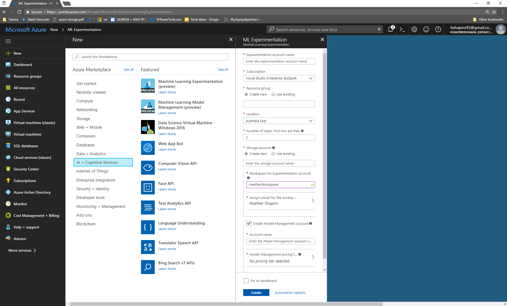

3. Fill out the Machine Learning Experimentation form with the following information:

| Setting                               | Suggested value                    | Description                                                                                                                                                                                                                                                                                                                                             |
|---------------------------------------|------------------------------------|---------------------------------------------------------------------------------------------------------------------------------------------------------------------------------------------------------------------------------------------------------------------------------------------------------------------------------------------------------|
| Experimentation account name          | *Unique name*                      | Choose a unique name that identifies your account. You can use your own name, or a departmental or project name that best identifies the experiment. The name should be 2 to 32 characters. It should include only alphanumeric characters and the dash (-) character.                                                                                  |
| Subscription                          | *Your subscription*                | Choose the Azure subscription that you want to use for your experiment. If you have multiple subscriptions, choose the appropriate subscription in which the resource is billed.                                                                                                                                                                        |
| Resource group                        | *Your resource group*              | You can make a new resource group name, or you can use an existing one from your subscription.                                                                                                                                                                                                                                                          |
| Location                              | *The region closest to your users* | Choose the location that's closest to your users and the data resources.                                                                                                                                                                                                                                                                                |
| Number of seats                       | 2                                  | Enter the number of seats. This selection affects the [pricing](https://azure.microsoft.com/pricing/details/machine-learning/). The first two seats are free. Use two seats for the purposes of this Quickstart. You can update the number of seats later as needed in the Azure portal.                                                                |
| Storage account                       | *Unique name*                      | Select **Create new** and provide a name to create an Azure storage account. Or, select **Use existing** and select your existing storage account from the drop-down list. The storage account is required and is used to hold project artifacts and run history data.                                                                                  |
| Workspace for Experimentation account | *Unique name*                      | Provide a name for the new workspace. The name should be 2 to 32 characters. It should include only alphanumeric characters and the dash (-) character.                                                                                                                                                                                                 |
| Assign owner for the workspace        | *Your account*                     | Select your own account as the workspace owner.                                                                                                                                                                                                                                                                                                         |
| Create Model Management account       | *check*                            | As part of the Experimentation account creation experience, you have the option of also creating the Machine Learning Model Management account. This resource is used when you're ready to deploy and manage your models as real-time web services. We recommend creating the Model Management account at the same time as the Experimentation account. |
| Account name                          | *Unique name*                      | Choose a unique name that identifies your Model Management account. You can use your own name, or a departmental or project name that best identifies the experiment. The name should be 2 to 32 characters. It should include only alphanumeric characters and the dash (-) character.                                                                 |
| Model Management pricing tier         | **DEVTEST**                        | Select **No pricing tier selected** to specify the pricing tier for your new Model Management account. For cost savings, select the **DEVTEST** pricing tier if it's available on your subscription (limited availability). Otherwise, select the S1 pricing tier for cost savings. Click **Select** to save the pricing tier selection.                |
| Pin to dashboard                      | *check*                            | Select the **Pin to dashboard** option to allow easy tracking of your Machine Learning Experimentation account on the front dashboard page of the Azure portal.                                                                                                                                                                                         |

1. Select **Create** to begin the creation process.

2. On the Azure portal toolbar, click **Notifications** (bell icon) to
    monitor the deployment process.

    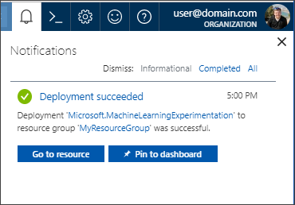The notification shows **Deployment in progress**. The status changes to **Deployment succeeded** when it's done. Your Machine Learning Experimentation account page opens upon success.

<h2> Scenario 1: Iris walk-through on Local

<h3>Prepare data

### Step \#1: Create a new project in the Workbench 

1. Open the Azure Machine Learning Workbench app, and log in if needed. In the **PROJECTS** pane, select the plus sign (**+**) to create a **New Project**.

    

2. Fill in the **Create New Project** details:

    

    - Fill in the **Project name** box with a name for the project. For
        example, use the value **myIris**.

    - Select the **Project directory** in which the project is created.
        For example, use the value C:\\Temp\\.

    - Enter the **Project description**, which is optional.

    - The **Git Repository** field is also optional and can be left blank. You can provide an existing empty Git repo (a repo with no master branch) on Visual Studio Team Services. If you use a Git repo that already exists, you can enable the roaming and sharing scenarios later. For more information, see [Use Git repo](https://docs.microsoft.com/en-us/azure/machine-learning/preview/using-git-ml-project).

    - Select a **Workspace**, for example, this tutorial uses **IrisGarden**.

    - Select the **Classifying Iris** template from the project template list.

3. Select the **Create** button. The project is now created and opened
    for you.

### Step \#2: Create a data preparation package

1. Open the **iris.csv** file from the **File View**. The file is a table with 5 columns and 150 rows. It has four numerical feature columns and a string target column. It does not have column headers.

    

2. In the **Data View**, select the plus sign (**+**) to add a new data source. The **Add Data Source** page opens.

    

3. Leave the default values, and then select the **Next** button.


<b> Important: Make sure you select the **iris.csv** file from within the
current project directory for this exercise. Otherwise, later steps
might fail.</b>

1.  After selecting the file, select the **Finish** button.

2.  A new file named **iris-1.dsource** is created. The file is named uniquely with a dash-1, because the sample project already comes with an unnumbered **iris.dsource** file.

The file opens, and the data is shown. A series of column headers, from **Column1** to **Column5**, is automatically added to this data set. Scroll to the bottom and notice that the last row of the data set is empty. The row is empty because there is an extra line break in the CSV file.

    

3. Select the **Metrics** button. Observe the histograms. A complete
    set of statistics has been calculated for each column. You can also
    select the **Data** button to see the data again.

    

4. Select the **Prepare** button. The **Prepare** dialog box opens.

    - The sample project comes with an **iris.dprep** file. By default, it asks you to create a new data flow in the **iris.dprep** data preparation package that already exists.

5. Select **+ New Data Preparation Package** from the drop-down menu, enter a new value for the package name, use **iris-1**, and then select **OK**.

    

    - A new data preparation package named **iris-1.dprep** is created and
    opened in the data preparation editor.

6. Now let's do some basic data preparation. Rename the column names.
    Select each column header to make the header text editable.

    - Enter **Sepal Length**, **Sepal Width** **Petal Length**, **Petal Width** and **Species** for the five columns respectively.

    

7. To count distinct values, select the **Species** column, and then right-click to select it. Select **Value Counts** from the drop-down menu.

    

    - This action opens the **Inspectors** pane, and displays a histogram
    with four bars. The target column has three distinct values: **Iris\_virginica**, **Iris\_versicolor**, **Iris-setosa**,
    and a **(null)** value.

1. To filter out nulls, select the bar from the graph that represents the null value. There is one row with a **(null)**value. To remove
    this row, select the minus sign (**-**).

    

1. Notice the individual steps detailed in the **STEPS** pane. As you renamed the columns and filtered the null value rows, each action was recorded as a data-preparation step. You can edit individual steps to adjust the settings, reorder the steps, and remove steps.

    

1. Close the data preparation editor. Select **Close** (x) on the **iris-1** tab with the graph icon. Your work is automatically saved into the **iris-1.dprep** file shown under the **Data Preparations** heading.

### Step \#3: Generate Python/PySpark code to invoke a data preparation package

1. Right-click the **iris-1.dprep** file to bring up the context menu, and then select **Generate Data Access Code File**.

    

1. A new file named **iris-1.py** opens with the following lines of code:

```python
# Use the Azure Machine Learning data preparation package

from azureml.dataprep import package

# Use the Azure Machine Learning data collector to log various
metrics

from azureml.logging import get\_azureml\_logger

logger = get\_azureml\_logger()

# This call will load the referenced package and return a DataFrame.
# If run in a PySpark environment, this call returns a

# Spark DataFrame. If not, it will return a Pandas DataFrame.

df = package.run('iris-1.dprep', dataflow\_idx=0)

# Remove this line and add code that uses the DataFrame

df.head(10)
```

- This code snippet invokes the logic you created as a data preparation package. Depending on the context in which this code is run, df represents the various kinds of dataframes. A [pandas DataFrame](https://pandas.pydata.org/pandas-docs/stable/generated/pandas.DataFrame.html) is used when executed in Python runtime, or a [Spark DataFrame](https://spark.apache.org/docs/latest/sql-programming-guide.html) is used when executed in a Spark context.

- For more information on how to prepare data in Azure Machine Learning Workbench, see the [Get started with data preparation](https://docs.microsoft.com/en-us/azure/machine-learning/preview/data-prep-getting-started) guide.

<h2> Build a model

### Step \#1: Review iris\_sklearn.py and the configuration files

1. Select the **Files** button (the folder icon) on the far-left pane to open the file list in your project folder.

2. Select the **iris\_sklearn.py** file. The Python code opens in a new text editor tab inside the workbench.

    

1. Review the Python script code to become familiar with the coding style. The script performs the following tasks:

    - Loads the data preparation package **iris.dprep** to create a [pandas
        DataFrame](https://pandas.pydata.org/pandas-docs/stable/generated/pandas.DataFrame.html).

>**Note**
>
>Use the iris.dprep data preparation package that comes with the sample project, which should be the same as the iris-1.dprep file you built in part 1 of this tutorial.
>- Adds random features to make the problem more difficult to solve. Randomness is necessary because Iris is a small data set that's easily classified with nearly 100% accuracy.
>- Uses the [scikit-learn](http://scikit-learn.org/stable/index.html) machine learning library to build a logistic regression model.
> - Serializes the model by inserting the [pickle](https://docs.python.org/2/library/pickle.html) library into a file in the outputs folder. The script then loads it and deserializes it back into memory.
>- Uses the deserialized model to make a prediction on a new record.
>- Plots two graphs, a confusion matrix and a multi-class receiver operating characteristic (ROC) curve, by using the [matplotlib](https://matplotlib.org/) library, and then saves them in the outputs folder.
>- The run\_logger object is used throughout to record the regularization rate and to model accuracy into the logs. The logs are automatically plotted in the run history.

### Step \#2: Execute iris\_sklearn.py script in a local environment

Let's prepare to run the **iris\_sklearn.py** script for the first time. This script requires the **scikit-learn** and **matplotlib** packages. The **scikit-learn** package is already installed by Azure Machine Learning Workbench. You still need to install **matplotlib**.

1. In Azure Machine Learning Workbench, select the **File** menu, and then select **Open Command Prompt** to open the command prompt.
    > The command-line interface window is referred to as the *Azure Machine Learning Workbench CLI window*, or *CLI window* for short.

2. In the CLI window, enter the following command to install the **matplotlib** Python package. It should finish in less than a minute.

    ```pip install matplotlib```

    ***Note***
    > If you skip the previous pip install command, the code in iris\_sklearn.py runs successfully. If you only run iris\_sklearn.py, the code doesn't produce the confusion matrix output and the multi-class ROC curve plots as shown in the history visualizations.

1. Return to the workbench app window.

2. In the toolbar at the top of the **iris\_sklearn.py** tab, select to open the drop-down menu that is next to the **Save** icon, and then select **Run Configuration**. Select **local** as the execution environment, and then enter iris\_sklearn.py as the script to run.

3. Next, move to the right side of the toolbar and enter 0.01 in the **Arguments** field.

    

1. Select the **Run** button. A job is immediately scheduled. The job is listed in the **Jobs** pane on the right side of the workbench window.

2. After a few moments, the status of the job transitions from **Submitting**, to **Running**, and then to **Completed**.

    

1.  Select **Completed** in the job status text in the **Jobs** pane. A pop-up window opens and displays the standard output (stdout) text
of the running script. To close the stdout text,select the **Close** (**x**) button on the upper right of the pop-up window.

2.  In the same job status in the **Jobs** pane, select the blue text **iris\_sklearn.py \[n\]** (*n* is the run number) just above the **Completed** status and the start time. The **Run Properties** window opens and shows the following information for that particular run:

    - **Run Properties** information

    - **Outputs** files

    - **Visualizations**, if any

    - **Logs**

When the run is finished, the pop-up window shows the following results:

>***Note***
>
> Because we introduced some randomization into the training set earlier, your exact results might vary from the results shown here.

```bash
Python version: 3.5.2 |Continuum Analytics, Inc.| (default, Jul  5 2016, 11:41:13) [MSC v.1900 64 bit (AMD64)]

Iris dataset shape: (150, 5)
Regularization rate is 0.01
LogisticRegression(C=100.0, class_weight=None, dual=False, fit_intercept=True,
       intercept_scaling=1, max_iter=100, multi_class='ovr', n_jobs=1,
       penalty='l2', random_state=None, solver='liblinear', tol=0.0001,
       verbose=0, warm_start=False)
Accuracy is 0.6792452830188679

==========================================
Serialize and deserialize using the outputs folder.

Export the model to model.pkl
Import the model from model.pkl
New sample: [[3.0, 3.6, 1.3, 0.25]]
Predicted class is ['Iris-setosa']
Plotting confusion matrix...
Confusion matrix in text:
[[50  0  0]
 [ 1 37 12]
 [ 0  4 46]]
Confusion matrix plotted.
Plotting ROC curve....
ROC curve plotted.
Confusion matrix and ROC curve plotted. See them in Run History details pane.

```

1. Close the **Run Properties** tab, and then return to the **iris\_sklearn.py** tab.

2. Repeat additional runs.
    - Enter a series of different numerical values in the **Arguments** field ranging from 0.001 to 10. Select **Run** to execute the code a few more times. The argument value you change each time is fed to the logistic regression algorithm in the code, and that results in different findings each time.

### Step \#3: Review the run history in detail

In Azure Machine Learning Workbench, every script execution is captured as a run history record. If you open the **Runs** view, you can view the
run history of a particular script.

1.  To open the list of **Runs**, select the **Runs** button (clock icon) on the left toolbar. Then select **iris\_sklearn.py** to show the **Run Dashboard** of iris\_sklearn.py.

    

1. The **Run Dashboard** tab opens. Review the statistics captured across the multiple runs. Graphs render in the top of the tab. Each run has a consecutive number, and the run details are listed in the table at the bottom of the screen.

    

1. Filter the table, and then select any of the graphs to view the status, duration, accuracy, and regularization rate of each run.

2. Select two or three runs in the **Runs** table, and select the **Compare** button to open a detailed comparison pane. Review the side-by-side comparison. Select the **Run List** back button on the upper left of the **Comparison** pane to return to the **Run Dashboard**.

3. Select an individual run to see the run detail view. Notice that the statistics for the selected run are listed in the **Run Properties** section. The files written into the output folder are listed in the **Outputs** section, and you can download the files from there.

    

The two plots, the confusion matrix and the multi-class ROC curve, are
rendered in the **Visualizations** section. All the log files can also
be found in the **Logs** section.

Deploy a model
--------------

### Step \#1: Download the model pickle file

In the previous part of the tutorial,the **iris\_sklearn.py** script was run in Machine Learning Workbench locally. That action serialized the logistic regression model by using the popular Python object-serialization
package [pickle](https://docs.python.org/2/library/pickle.html).

1. Open the Machine Learning Workbench application, and then open the **myIris** project you created in the previous part of the tutorial series.

2. After the project is open, select the **Files** button (folder icon) on the left pane to open the file list in your project folder.

3. Select the **iris\_sklearn.py** file. The Python code opens in a new text editor tab inside the workbench.

4. Review the **iris\_sklearn.py** file to see where the pickle file was generated. Select Ctrl+F to open the **Find**dialog box, and then find the word **pickle** in the Python code.
    - This code snippet shows how the pickle output file was generated. The output pickle file is named **model.pkl** on the disk.

    ```python
    print("Export the model to model.pkl")
    f = open('./outputs/model.pkl', 'wb') pickle.dump(clf1, f)
    f.close()
    ```

1. Locate the model pickle file in the output files of a previous run.

    When you ran the **iris\_sklearn.py** script, the model file was written to the **outputs** folder with the name **model.pkl**. This folder lives in the execution environment that you choose to run the script, and not in your local project folder.

    - To locate the file, select the **Runs** button (clock icon) on the
    left pane to open the list of **All Runs**.

    - The **All Runs** tab opens. In the table of runs, select one of the recent runs where the target was **local** and the script name was **iris\_sklearn.py**.

    - The **Run Properties** pane opens. In the upper-right section of the pane, notice the **Outputs** section.

    - To download the pickle file, select the check box next to the **model.pkl** file, and then select the **Download** button. Save it to the root of your project folder. The file is needed in the upcoming steps.

    

### Step \#2: Get the scoring script and schema files

### To deploy the web service along with the model file, you also need a scoring script, and optionally, a schema for the web-service input data. The scoring script loads the **model.pkl** file from the current folder and uses it to produce a newly predicted Iris class.

1.  Select the **Files** button (folder icon) on the left pane to open the file list in your project folder.

2.  Select the **score\_iris.py** file. The Python script opens. This file is used as the scoring file.

    

1.  To get the schema file, run the script. Select the **local** environment and the **score\_iris.py** script in the
command bar, and then select the **Run** button.

2.  This script creates a JSON file in the **Outputs** section, which captures the input data schema required by the model.

3.  Note the **Jobs** pane on the right side of the **Project Dashboard** pane. Wait for the latest **score\_iris.py** job to display the green **Completed** status. Then select the hyperlink **score\_iris.py \[1\]** for the latest job run to see the run details from the **score\_iris.py** run.

4.  On the **Run Properties** pane, in the **Outputs** section, select the newly created **service\_schema.json** file. Select the check box next to the file name, and then select **Download**. Save the file into your project root folder.

5.  Return to the previous tab where you opened the **score\_iris.py** script. By using data collection, you can capture model inputs and predictions from the web service. The following steps are of particular interest for data collection.

6.  Review the code at the top of the file imports class **ModelDataCollector**, because it contains the model data collection functionality:

    ```from azureml.datacollector import ModelDataCollector```

1.  Review the following lines of code in the **init()** function that instantiates **ModelDataCollector**:

```python
global inputs_dc, prediction_dc
inputs_dc = ModelDataCollector('model.pkl',identifier="inputs")
prediction_dc = ModelDataCollector('model.pkl', identifier="prediction")`
```

1.  Review the following lines of code in the **run(input\_df)** function as it collects the input and prediction data:

```python
global clf2, inputs_dc, prediction_dc
inputs_dc.collect(input_df)
prediction_dc.collect(pred)
```

Now you're ready to prepare your environment to operationalize the model.

### Step \#3: Prepare to operationalize locally

Use *local mode* deployment to run in Docker containers on your local
computer.

You can use *local mode* for development and testing. The Docker engine must be run locally to complete the following steps to operationalize the model. You can use the -h flag at the end of the commands for
command Help.

>***Note***
>
>If you don't have the Docker engine locally, you can still proceed by creating a cluster in Azure for deployment. Just be sure to delete the
cluster after the tutorial so you don't incur ongoing charges.

1.  Open the command-line interface (CLI). In the Azure Machine Learning Workbench application, on the **File** menu, select **Open Command Prompt**.
    The command-line prompt opens in your current project folder location **c:\\temp\\myIris&gt;**.

1.  Make sure you are logged in with ```az login```

2.  Make sure the Azure resource provider **Microsoft.ContainerRegistry** is registered in your subscription. You must register this resource provider before you can create an environment in step 3. You can check to see if it's already registered by using the following command:

    ```bash
    az provider list
    --query "[].{Provider:namespace, Status:registrationState}"
    --out table
    ```
    ```
    Provider Status
    -------- ------
    Microsoft.Authorization Registered

    Microsoft.ContainerRegistry Registered

    microsoft.insights Registered

    Microsoft.MachineLearningExperimentation Registered
    ```

If **Microsoft.ContainerRegistry** is not registered, you can register it by using the following command:
    ```az provider register --namespace Microsoft.ContainerRegistry```

Registration can take a few minutes. You can check on its status by using the previous ```az provider list``` command or ```az provider show -n Microsoft.ContainerRegistry```

The third line of the output displays **"registrationState":
 ```
 "Registering"**. Wait a few moments and repeat the **show** command until the output displays **"registrationState": "Registered"**.
 ```

1.  Create the environment. You must run this step once per environment.
    - For example, run it once for development environment, and once for production. Use *local mode* for this first environment. You can try the -c or --cluster switch in the following command to set up an environment in *cluster mode* later.

    - Note that the following setup command requires you to have Contributor access to the subscription. If you don't have that, you at least need Contributor access to the resource group that you are deploying into. To do the latter, you need to specify the resource group name as part of the setup command using -g the flag.

    ```az ml env setup -n &lt;new deployment environment name&gt; --location <e.g. eastus2>```

 Follow the on-screen instructions to provision a storage account for storing Docker images, an Azure container registry that lists the Docker images, and an AppInsight account that gathers telemetry. If you used the -c switch, it creates an Azure Container Service cluster too.

 The cluster name is a way for you to identify the environment. The location should be the same as the location of the Model Management account you created from the Azure portal.

1. Create a Model Management account. (This is a one-time setup.)

    ```az ml account modelmanagement create --location <e.g. eastus2> -n &lt;new model management account name&gt; -g <existing resource group name> --sku-name S1```

1. Set the Model Management account.

    ```az ml account modelmanagement set -n <youracctname> -g <yourresourcegroupname>```

1. Set the environment.

After the setup finishes, use the following command to set the environment variables required to operationalize the environment. Use the same environment name that you used previously in step 4. Use the same resource group name that was output in the command window when the setup process finished.

``` az ml env set -n <deployment environment name> -g <existing resource group name>```

2. To verify that you have properly configured your operationalized environment for local web service deployment, enter the following command:

    ```az ml env show```

Now you're ready to create the real-time web service.

><b>Note</b>
>
>You can reuse your Model Management account and environment for subsequent web service deployments. You don't need to create them for each web service. An account or an environment can have multiple web services associated with it.

### Step \#4: Create a real-time web service in one command

1. To create a real-time web service, use the following command:

    ```az ml service create realtime -f score\_iris.py --model-file model.pkl -s service\_schema.json -n irisapp -r python --collect-model-data true```

    This command generates a web service ID you can use later.

    The following switches are used with the **az ml service create realtime** command:
    - -n: The app name, which must be all lowercase.
    - -f: The scoring script file name.
    - --model-file: The model file. In this case, it's the pickled model.pkl file.
    - -r: The type of model. In this case, it's a Python model.
    - --collect-model-data true: This enables data collection.

> Important
>
> The service name, which is also the new Docker image name, must be all lowercase. Otherwise, you get an error.

2. When you run the command, the model and the scoring file upload to the storage account you created as part of the environment setup.The deployment process builds a Docker image with your model, schema, and scoring file in it, and then pushes it to the Azure container registry: **&lt;ACR\_name&gt;.azureacr.io/&lt;imagename&gt;:&lt;version&gt;**.

The command pulls down the image locally to your computer, and then starts a Docker container based on that image. If your environment is configured in cluster mode, the Docker container is deployed into the Azure Cloud Services Kubernetes cluster instead.

As part of the deployment, an HTTP REST endpoint for the web service is created on your local machine. After a few minutes, the command should finish with a success message and your web service is ready for action.

3. To see the running Docker container, use the **docker ps** command:

    ```docker ps```

### Step \#5: Run the real-time web service

To test the **irisapp** web service that's running, use a JSON-encoded record containing an array of four random numbers:

1. The web service includes sample data. When running in local mode, you can call the **az ml service usage realtime** command. That call retrieves a sample run command that's useful for you to use to test the service. The call also retrieves the scoring URL that you can use to incorporate the service into your own custom app:

    ```az ml service usage realtime -i <service ID>```

1. To test the service, execute the returned service run command:

    ```az ml service run realtime -i irisapp -d "{\"input_df\": [{\"petal width\": 0.25, \"sepal length\": 3.0, \"sepal width\": 3.6, \"petal length\": 1.3}]}"```

 The output is **"2"**, which is the predicted class. (Your result might be different.)

3. To run the service from outside the CLI, you need to get the keys for authentication:

    ```az ml service keys realtime -i <web service ID>```

Scenario\#2: Change the Data Source to SQL Server and Experimentation Compute Target to a DSVM
==============================================================================================

In this scenario, we will learn how to change the data source for an
existing data flow within a preparation package.

Change the Data Source to Azure SQL:
------------------------------------

This part assumes that you have the iris data loaded to an Azure SQL DB.
P@ssw0rd1

You can use the following script to create the iris table, and then use
SSMS or another tool to upload iris.csv to the table.

```sql
CREATE TABLE \[dbo\].\[iris\](

\[Sepal Length\] \[varchar\](50) NULL,

\[Sepal Width\] \[varchar\](50) NULL,

\[Petal Length\] \[varchar\](50) NULL,

\[Petal Width\] \[varchar\](50) NULL,

\[Species\] \[varchar\](50) NULL

)
```

**Ensure that Azure SQL DB Firewall allows connection from your IP
address**.

You will need to whitelist your public IP Address

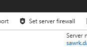

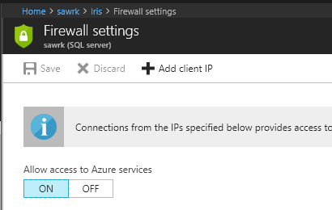

<h3>Create a new Data Source in the workbench by connecting to the Azure DB.<h3>

1. Click on Add Data Source from the Data Tab:

    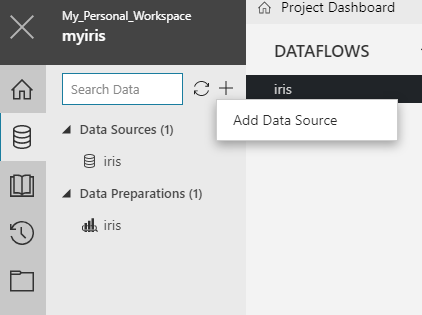

2. Select Database from the supported data stores, and provide connection details as well as the query to read from the database:

    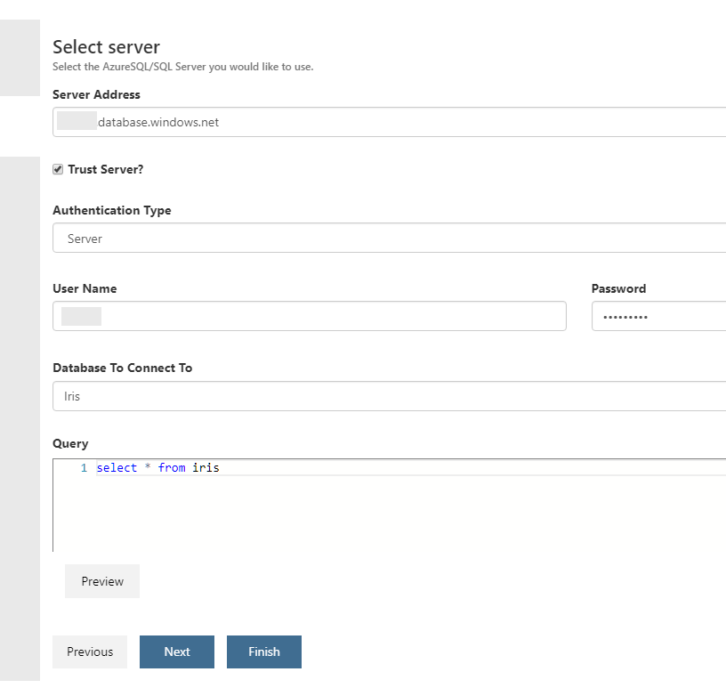

3. You may click on Preview to see the data.

4. Click Next, select the default sampling scheme

5. Click Finish.

A new data source has been created. Note the name of the dataflow created. You will need to use that in the next step.

***Normally – You could just change the datasource in the local
runconfig.***

You can substitute the datasource in the runconfig file. You will have one runconfig file per environment. In this step, we will do the
substitution in the local runconfig file.

1. Open the local.runconfig file by clicking on local.runconfig from
the Files tab

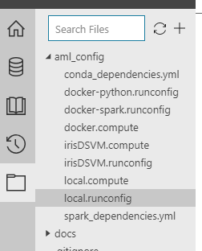

2. Go to the edit mode by clicking on ‘Edit as text in Workbench’

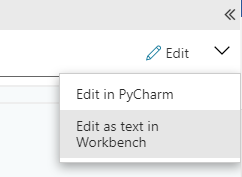

3. Add the following lines to the local.runconfig and save it. If you named your data source differently, use the appropriate name.

    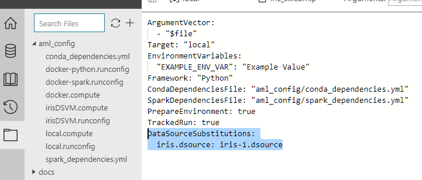

**Run the iris\_sklearn.py file on the local compute environment**

1. Click on the Run button to execute the python script in the local compute environment. A job should get created and executed.

    

However it fails because we have to do some data prep first with the SQL computefest database.

1. Click the computefest datasource and select **Prepare**

2. Notice that the columns are listed as strings instead of numbers. We can change that by deriving a column by example. Right click on the
**Sepal Length** column and select **Derive Column by Example**

3. Type **5.1**.

4. Notice that the rest of the column should autofill. Select **OK** and click the **\#** sign to convert the column to numeric. Now repeat this step for Sepal Width, Petal Length, and Petal Width.

5. Delete the duplicate columns.

6. Rename the new numeric columns.

7. Don’t forget to remove the null column at the end like we did earlier!

**We can now go change the dprep file in the iris\_sklearn.py file and run.**

Change the Compute Target to DSVM:
----------------------------------

In the previous step we learned how to change the data source for an existing data flow within a data preparation package. In this step, we
will learn how to run your scripts on an Azure DSVM from the workbench.

We will use an already provisions DSVM. See this link for provisioning a DVSM of your own:
<https://docs.microsoft.com/en-us/azure/machine-learning/preview/how-to-create-dsvm-hdi>

1. Open the command prompt from the file menu of the Azure ML Workbench. Then, attach the DSVM compute target using the following command. Give a compute target name you want to use.

    ```az ml computetarget attach remotedocker --name <compute target name> --address <ip address or FQDN> --username <admin username> --password <admin password>```

    ***It may take 5-10 minutes.***

2. Run the following command to prepare the Docker image of the DSVM

    ```az ml experiment prepare -c <compute target name>```

    ***It may take another 10 minutes to complete.***

3. Select the new compute target from the dropdown in the header and click Run. A job should get created. This time, the data is being
fetched from the SQL server and the experimentation is being executed on the Azure DSVM.

    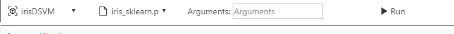

Scenario\#3: Read Data from Blob Store, run experiment on HDI Cluster and Operationalize to ACS – **TO DO ON YOUR OWN**
=======================================================================================================================

**Connect to Blob Storage:**

This assumes that your iris.csv file is stored at the Azure blob store.

1.  Create a new data source:

    1.  Click the Data button (cylinder icon) on the left toolbar. This
        displays the Data View.

    2.  Select the + icon and then select Add Data Source.  
        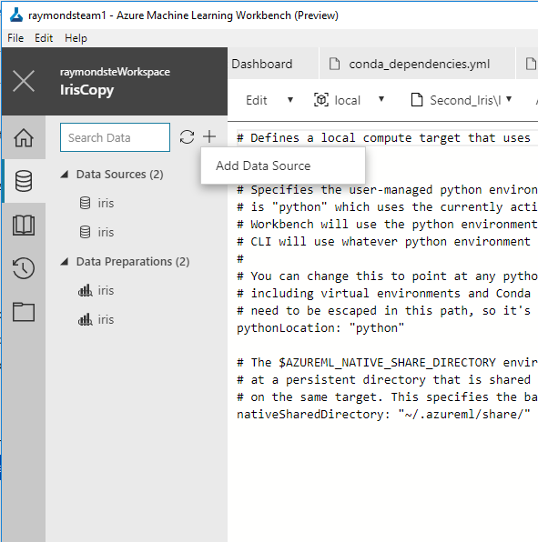

    3.  Select ‘Files/Directory’ and click ‘Next’

    4.  Click the down arrow in the ‘Path’ box and select ‘Azure Blob’  
        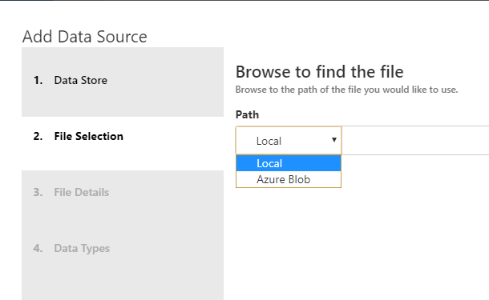

    5.  Click ‘Browse’ and select the Azure Subscription you’d like
        to use.

    6.  Click the Azure Storage account you’d like to use.

    7.  Selected the container and file you’d like to use.

    8.  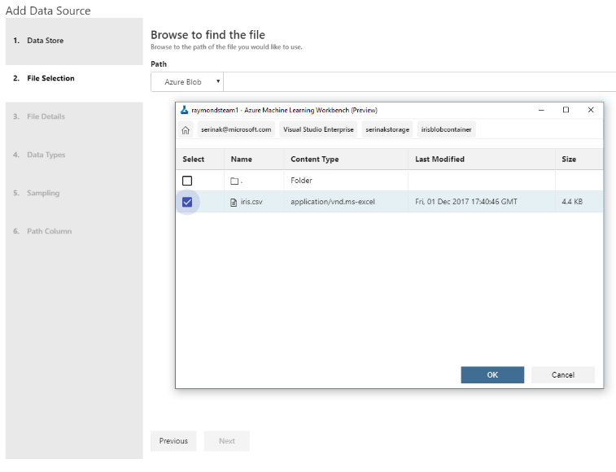Click
        ‘Next’ – it is ok to accept all the defaults.

    9.  After selecting the file, select the Finish button.

    10. A new file named iris-1.dsource (or something similar)
        is created. The file is named uniquely with a dash-1, because
        the sample project already comes with an unnumbered
        iris.dsource file.

**Create an HDInsight Cluster and Run Your Experiment**

1.  **Create the cluster -** To run scale-out Spark jobs, you need to
    create an Apache Spark for Azure HDInsight cluster in Azure portal.

    -   Log on to Azure portal from <https://portal.azure.com>

    -   Click on the +NEW link, and search for "HDInsight".

    -   Choose HDInsight in the list, and then click on the
        Create button.

    -   In the Basics configuration screen, Cluster type settings, make
        sure you choose Spark as the Cluster type, Linux as the
        Operating system, and Spark 2.1.0 (HDI 3.6) as the \_Version.

    <!-- -->

    -   Choose the cluster size and node size you need and finish the
        creation wizard. It can take up to 30 minutes for the cluster to
        finish provisioning.

2.  **Attach the HDI Spark cluster as a compute target -** Once the
    Spark HDI cluster is created, you can now attach it to your Azure
    ML project.

3.  **Substitute the data source in the corresponding runconfig file:**
    Add the following lines to the runconfig file:

> DataSourceSubstitutions:
>
> iris.dsource: &lt;new data source name&gt;.dsource

1.  **Run the experiment on the cluster** - Run the following command,
    and the script runs in the HDInsight cluster:

> **Operationalize Your Model with Azure Container Service**

1.  **Download the model pickle file -** Locate the model pickle file in
    the output files of a previous run. When you ran the
    iris\_sklearn.py script, the model file was written to the outputs
    folder with the name model.pkl. This folder lives in the execution
    environment that you choose to run the script, and not in your local
    project folder.

    -   To locate the file, select the Runs button (clock icon) on the
        left pane to open the list of All Runs.

    -   The All Runs tab opens. In the table of runs, select one of the
        recent runs where the target was local and the script name
        was iris\_sklearn.py.

    -   The Run Properties pane opens. In the upper-right section of the
        pane, notice the Outputs section.

    -   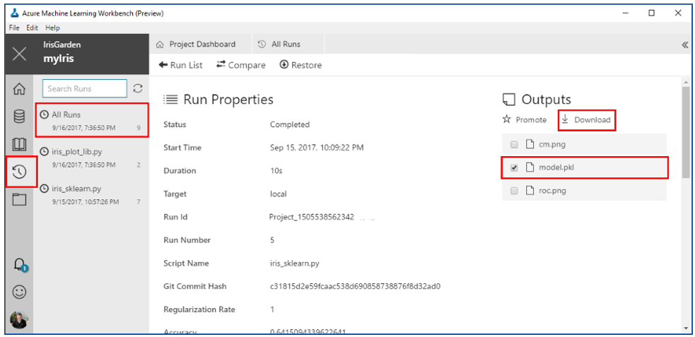To
        download the pickle file, select the check box next to the
        model.pkl file, and then select the Download button. Save it to
        the root of your project folder. The file is needed in the
        upcoming steps.

2.  **Get the scoring script and schema files** - To deploy the web
    service along with the model file, you also need a scoring script,
    and optionally, a schema for the web-service input data. The scoring
    script loads the model.pkl file from the current folder and uses it
    to produce a newly predicted Iris class.

    -   Select the score\_iris.py file. The Python script opens. This
        file is used as the scoring file.

    -   To get the schema file, run the script.

        -   Select the local environment and the score\_iris.py script
            in the command bar, and then select the Run button. This
            script creates a JSON file in the Outputs section, which
            captures the input data schema required by the model.  
              
            Note the Jobs pane on the right side of the Project
            Dashboard pane. Wait for the latest score\_iris.py job to
            display the green Completed status. Then select the
            hyperlink score\_iris.py \[1\] for the latest job run to see
            the run details from the score\_iris.py run.

    -   On the Run Properties pane, in the Outputs section, select the
        newly created service\_schema.json file. Select the check box
        next to the file name, and then select Download. Save the file
        into your project root folder.

3.  **Ensure your subscription is registered with Azure Container
    Registry** – Make sure the Azure resource provider
    Microsoft.ContainerRegistry is registered in your subscription. You
    must register this resource provider before you can create
    an environment.

4.  **Create and set your model management account - **

5.  **Register the environment** – To start the setup process, you need
    to register the environment provider by entering the following
    command:

6.  **Setup and then set the environment -** Use Cluster deployment for
    high-scale production scenarios. It sets up an ACS cluster with
    Kubernetes as the orchestrator. The ACS cluster can be scaled out to
    handle larger throughput for your web service calls. The resource
    group, storage account, and ACR are created quickly. The ACS
    deployment can take up to 20 minutes.  
      
    A resource group (if not provided, or if the name provided does
    not exist)

-   A storage account

-   An Azure Container Registry (ACR)

-   A Kubernetes deployment on an Azure Container Service (ACS) cluster

-   An Application insights account

1.  **Deploy -** You are now ready to deploy your saved model as a
    web service.

2.  **Test the service** - Use the following command to get information
    on how to call the service:+

**Addendum, if needed - Creating an Azure Blob Storage Account:**

1.  Go to Azure portal

2.  Select “+ Create a Resource’

3.  Type in ‘blob storage’

4.  Follow instructions on screen and deploy

5.  Once service has been deployed, create a new container for Iris
    data:

    1.  From Blob service, choose ‘+ Container’

    2.  Name your new container, e.g. iriscontainer

    3.  Accept defaults and click ‘OK’

6.  Click on new container

7.  Find the iris.csv file on your hard drive and upload it to blob
    storage


